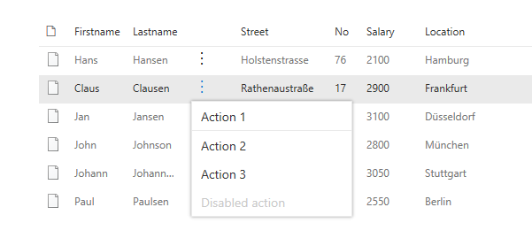
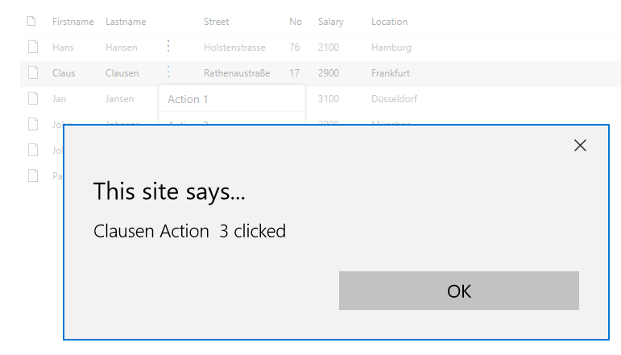

# react-listview-context-ecb

## Summary

This small sample illustrates how to extend the PnP React SPFx ListView control with a contextual menu.

In action this looks like:

Choose a contextual action:

See the result:

For further details see the author's [blog post](https://mmsharepoint.wordpress.com/2018/03/11/extend-pnp-sharepoint-framework-react-listview-control-with-a-context-menu/)

## Used SharePoint Framework Version

## Applies to

- [SharePoint Framework](https://aka.ms/spfx)
- [Microsoft 365 tenant](https://docs.microsoft.com/en-us/sharepoint/dev/spfx/set-up-your-developer-tenant)

## Solution

Solution|Author(s)
--------|---------
react-listview-context-ecb| [Markus Moeller](https://github.com/mmsharepoint) ([@moeller2_0](http://www.twitter.com/moeller2_0))

## Version history

Version|Date|Comments
-------|----|--------
1.0|December 26, 2022|Initial release

## Disclaimer

**THIS CODE IS PROVIDED *AS IS* WITHOUT WARRANTY OF ANY KIND, EITHER EXPRESS OR IMPLIED, INCLUDING ANY IMPLIED WARRANTIES OF FITNESS FOR A PARTICULAR PURPOSE, MERCHANTABILITY, OR NON-INFRINGEMENT.**

## Disclaimer

**THIS CODE IS PROVIDED _AS IS_ WITHOUT WARRANTY OF ANY KIND, EITHER EXPRESS OR IMPLIED, INCLUDING ANY IMPLIED WARRANTIES OF FITNESS FOR A PARTICULAR PURPOSE, MERCHANTABILITY, OR NON-INFRINGEMENT.**

---

## Minimal Path to Awesome

- Clone this repository
- Ensure that you are at the solution folder
- in the command-line run:
  - **npm install**
  - **gulp serve**
- With Mockup data you are good to go
- Now you can start to adjust to your own custom list data

## Features

Description of the extension that expands upon high-level summary above.

This extension illustrates the following concepts:

- [PnP React SPFx control ListView](https://pnp.github.io/sp-dev-fx-controls-react/controls/ListView/)
  - [Add contextual menu](https://pnp.github.io/sp-dev-fx-controls-react/controls/ListView.ContextualMenu/)
- [FluentUI Contextual Menu](https://developer.microsoft.com/en-us/fluentui#/controls/web/contextualmenu)

## References

- [Getting started with SharePoint Framework](https://docs.microsoft.com/en-us/sharepoint/dev/spfx/set-up-your-developer-tenant)
- [Microsoft 365 Patterns and Practices](https://aka.ms/m365pnp) - Guidance, tooling, samples and open-source controls for your Microsoft 365 development
